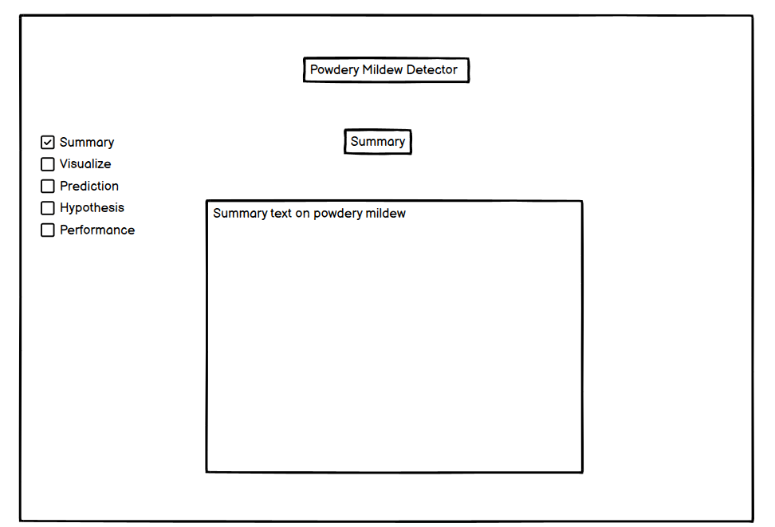
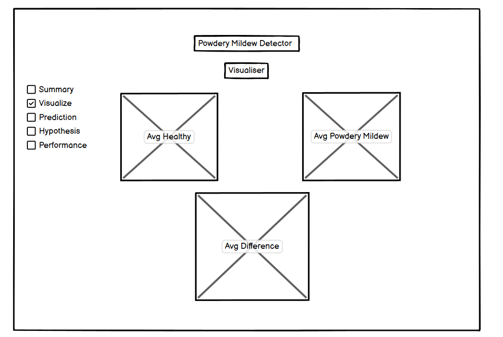
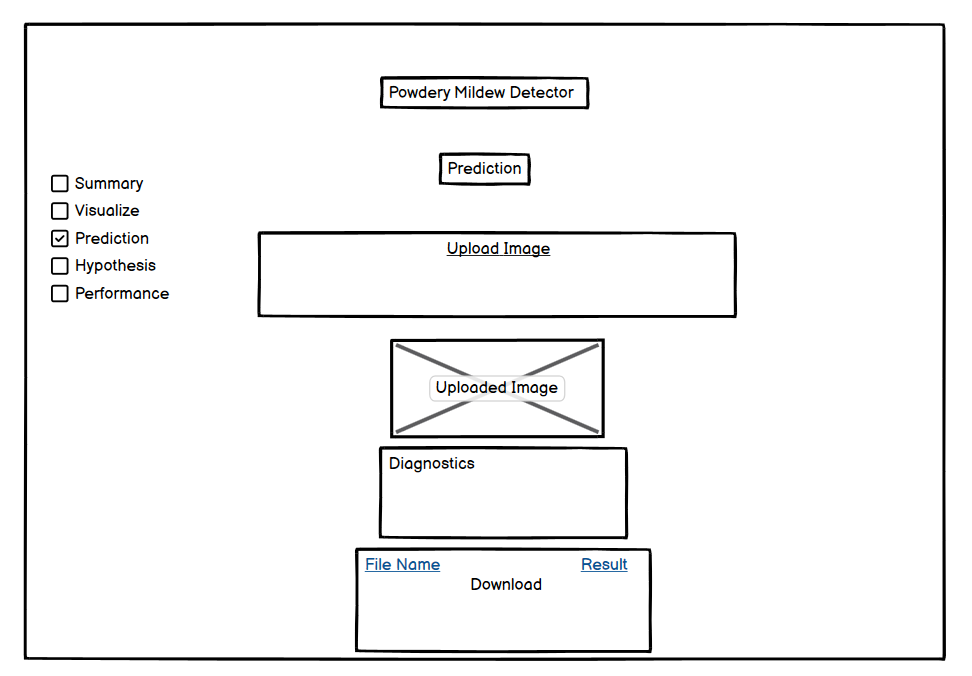
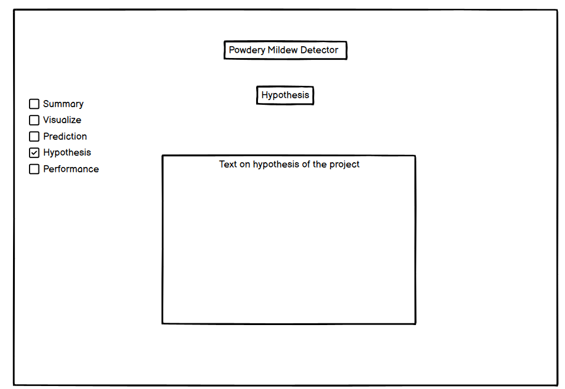
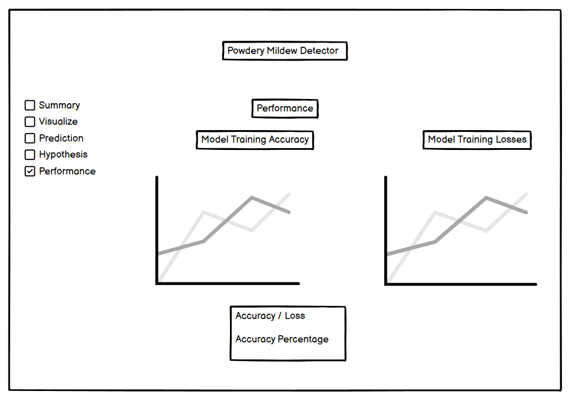

# Mildew Detection

## Data Collection

In the start of data collection it is crucial to install kaggle. It is important because we need the dataset in order to make a prediction. As well as recieving the dataset in data collection we also need to configure the kaggle.json file.

## Data Visualisation

In data visualisation it should show a clear difference between the healthy leaves and leaves affected by the powdery mildew.
There are going to be a figure showing the average healthy leaf and powdery mildew leaf.

## Modelling and evaluating

In modelling and evaluating we are going to make a prediction on whether the leaf image is healthy or not. In order to do this
we are going to be building several figures. To start by augmenting the image data in the test, training and validation image sets. After that building a CNN model is vital in the devleopment of this project

## Summary Page

Powdery mildew is a parasitic fungal disease caused by various species. It affects a wide range of plants and infected plants and appears white.

As the infection grows the white parts of the plant will continue to get larger and combine with each other.

Powdery mildew is most infectious when in humid weather.

In the kaggle dataset that we collected there are 4208 images of a mixture of healthy leaves and one affected by powdery mildew.

## Visualiser

## Prediction

## Hypothesis

## Performance

Train - healthy: 1472 images
Train - powdery_mildew: 1472 images
Validation - healthy: 210 images
Validation - powdery_mildew: 210 images
Test - healthy: 422 images
Test - powdery_mildew: 422 images

## Business Requirements

- The client wants to be able to visualise the difference between the healthy and powdered mildew leaves.

- There should also be a prediction on whether a leaf is healthy or has got powdered mildew.

- It also needs to have a working dashboard. This must be interactive and allow the user to upload multiple images
and make accurate predictions.

## Technology Used

- Python

- Gitpod was used in order to create and develop the workspace that I have worked on.

- Github is used to store the repository and to show the files and progression of the workspace.

- Heroku allows us to deploy the web application.

- Numpy is an open source which allows the user to work with arrays, it is very efficient and a vital part in this project.

- Pandas is also an open source that allows the user to work with the datasets. Using pandas gives the ability to analyze, clean and explore the data.

- Matplotlib is used for visualising and plotting data.

- Tensorflow is a open source machine learning platform that lets us build and train the machine.

- Seaborn is a visualisation tool that works with matplotlib. It can be used for statistical uses.

- Streamlit is used to create web apps that are interactive.

- Joblib is a tool to help with efficiency especially with arrays.

- Pil helps us open and manipulate images. It is an open source library for python.

## Wireframes

## Bugs

- A bug that I encountered was that the slug size was too large for heroku to handle, because of this I added the healthy, powdery mildew, train and test image sets. As well as moving image sets to slugignore I also reduced the image size to ensure that the slug size did not reach the maximum cap.

- The python version that was originally in use was not compatible with heroku so I had to update it to 3.9.15, which then proved to be successful.

## Credits

- I used code I learnt from the [Code Institute Malaria Walkthrough Project](https://learn.codeinstitute.net/courses/course-v1:code_institute+CI_DA_ML+2021_Q4/courseware/07a3964f7a72407ea3e073542a2955bd/29ae4b4c67ed45a8a97bb9f4dcfa714b/) this helped me significantly as I then used the knowledge I received to make this powdery mildew detector.